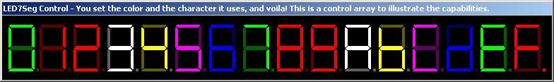



## LED 7 Segment Control 1\.1

### Description

Just a few fixes added to this one. I made it easier to select the colors. Now you just change the "Color" property to any of the enums that popup. It does the rest for you. The Demo will illustrate that as well as the screen shot. Don't worry, I'm working on scaling. :-) PLEASE vote!!
 
### More Info
 

             |
---                |---
**Submitted On**   |2002-07-05 09:30:00
**By**             |[James W\. Manning](https://github.com/Planet-Source-Code/PSCIndex/blob/master/ByAuthor/james-w-manning.md)
**Level**          |Intermediate
**User Rating**    |3.8 (15 globes from 4 users)
**Compatibility**  |VB 6\.0
**Category**       |[Custom Controls/ Forms/  Menus](https://github.com/Planet-Source-Code/PSCIndex/blob/master/ByCategory/custom-controls-forms-menus__1-4.md)
**World**          |[Visual Basic](https://github.com/Planet-Source-Code/PSCIndex/blob/master/ByWorld/visual-basic.md)
**Archive File**   |[LED\_7\_Segm102273752002\.zip](https://github.com/Planet-Source-Code/james-w-manning-led-7-segment-control-1-1__1-36602/archive/master.zip)

